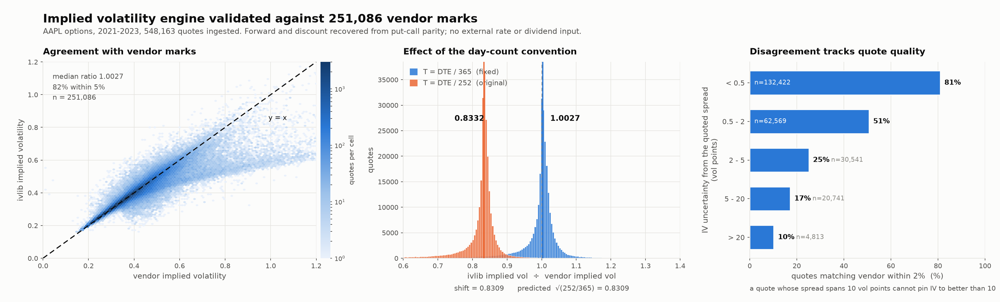
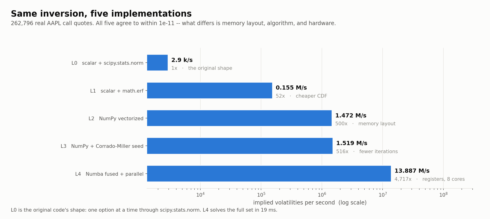
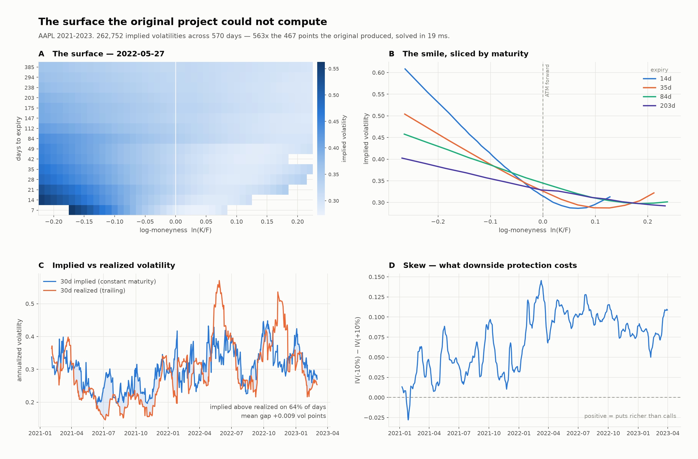

# IVchart

Implied volatility from option chains — a vectorized engine, validated against
vendor marks on 548k real quotes, and an app that charts implied vs realized vol
for any ticker over time.



## Results

| | |
|---|---|
| Throughput | **13.9M IV/s** (Numba, 8-core Mac) · 32.1M/s (20-thread Intel) · 1.5M/s pure NumPy |
| Agreement with vendor marks | median ratio **1.0027**, 81.9% within 5% |
| On quotes the market pins to ±2 vol points (77.7%) | median 1.0043, 92.5% within 5% |
| Coverage | 95.8% solved; the rest rejected as outside no-arb bounds |
| Tests | 90 |

## Layout

```
ivlib/      the engine
  pricing   Black-76, greeks, no-arb bounds, initial guesses
  solver    bracketed Newton — NumPy reference + Numba kernel
  market    quote filtering (with rejection waterfall) + forward/discount from put-call parity
  surface   smiles, skew, term structure, constant-maturity series
app/        the product
  sources   Yahoo chains + price history, Cboe indices via FRED, GitHub watchlist writes
  data      chain schema, on-disk layout
  pipeline  snapshot + compute jobs, realized vol
  api       FastAPI over the above
web/        React + Recharts frontend (Vite)
bench/      validate, ladder, surface (+ figures/)
data/       chains/ (daily snapshots, committed) · vendor/ (AAPL 2021-23, 548k quotes, Parquet)
```

## The engine

```python
from ivlib import surface
table = surface.build_iv_table(chain)            # filter → parity → solve, every strike
iv30  = surface.constant_maturity(surface.atm_term_structure(table), 30)
```

- **Forward space.** `C − P = df·(F − K)` is a line in K; fit it per expiry and
  the rate and dividend fall out. Nothing is downloaded. Median R² = 0.99998
  across 7,845 expiries.
- **Bracketed Newton.** A Newton step is taken only if it lands inside a bracket
  that provably contains the root; otherwise bisect. Can't freeze, can't diverge.
  Convergence is on σ, not price — absolute price tolerance fails in the wings.
- **No-arb prefilter.** Quotes outside the bounds have no implied vol at any σ;
  they're rejected explicitly and counted.
- **Day count.** `T = calendar_days / 365`. The original divided a calendar count
  by 252, biasing IV low by exactly √(252/365) = 0.8309 — predicted, then measured
  at 0.8309 on 251,086 quotes.

### The ladder

Same inversion, same 262,796 quotes, all agreeing to 1e-11:

| rung | M/s | vs L0 | source of the win |
|---|---|---|---|
| L0 scalar + `scipy.stats.norm` | 0.003 | 1× | the original shape |
| L1 scalar + `math.erf` | 0.155 | **52×** | cheaper CDF |
| L2 NumPy vectorized | 1.472 | 500× | memory layout |
| L3 NumPy + Corrado-Miller seed | 1.519 | 516× | fewer iterations |
| L4 Numba fused + parallel | **13.887** | **4,717×** | registers, all cores |



Two results against expectation: the biggest single jump is swapping
`scipy.stats.norm.cdf` for `erf` (52×, no algorithmic change), and the
algorithmic rung paid least (1.05× — mean iterations only 6.89 → 6.26; the 1e-12
tolerance floors Newton at ~3–4 steps and a tail needs bisection regardless).

Residual disagreement with the vendor tracks the market's own resolution
(half-spread ÷ vega): 81% within 2% for the tightest quotes, 10% for the widest.
A quote whose spread spans 10 vol points can't pin IV to better than 10.



## The app

```bash
pip install -e ".[app]"
uvicorn app.api:app --reload --port 8000      # http://localhost:8000/docs
cd web && npm install && npm run dev           # http://localhost:5173
```

Type a ticker: 30d implied vs 21d realized over time, today's smile by expiry, a
funnel of what fraction of the chain was usable. **Track** adds a ticker to the
watchlist.

**History.** No free source of historical chains exists, so the app builds its
own: `app/pipeline.py snapshot` stores each watched ticker's chain daily
(~15 KB/ticker/day → `data/chains/`), run by a GitHub Actions cron 30 min before
the close. Implied history for a ticker starts the day it's added. Realized vol is
full-length from day one. AAPL has 2021–23 from a vendor dataset; AAPL/AMZN/GOOG/GS/IBM
have Cboe's vol indices back to 2010 (a variance-strip rate, ~10% above ATM vol on
AAPL, correlation 0.98 — a second independent check on the engine).

Two rules from the data: the snapshot refuses chains captured outside regular
hours (Yahoo returns bid = ask = 0 then), and never uses Yahoo's `impliedVolatility`
column (a placeholder — 0.00001 on every ITM contract).

### Deploying

| piece | host | updates on |
|---|---|---|
| `web/` | Vercel — root dir `web`, env `VITE_API_BASE` | push |
| `app/api.py` | Render free — `render.yaml`; set `GITHUB_TOKEN` (fine-grained, Contents r/w) | push, incl. daily snapshot commits |
| snapshot cron | GitHub Actions | schedule |

Render sleeps after 15 min idle (~1 min wake); first request after a deploy pays
a numba JIT. Peak RSS ~345 MB of 512.

## Benchmarks

```bash
python -m bench.validate --plot        # vs vendor marks
python -m bench.ladder --plot          # five implementations
python -m bench.surface                # the surface figure
pytest
```
